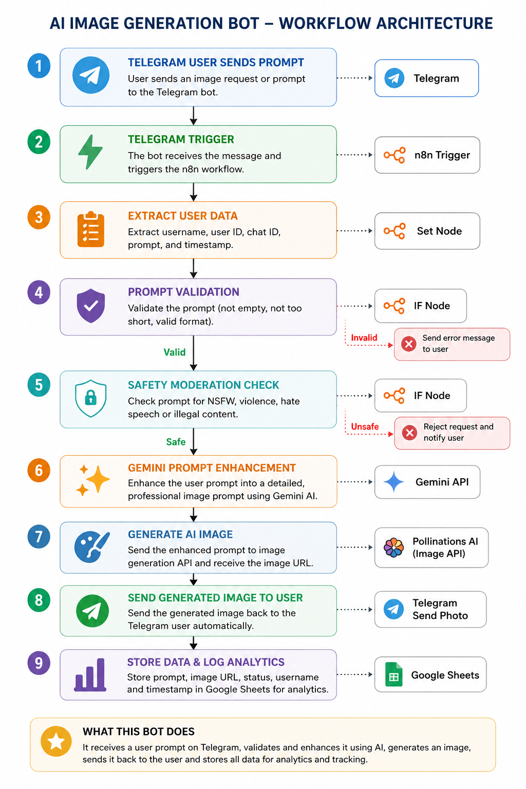
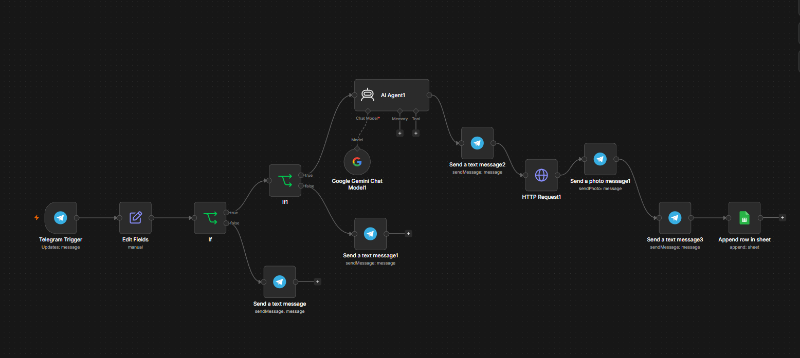
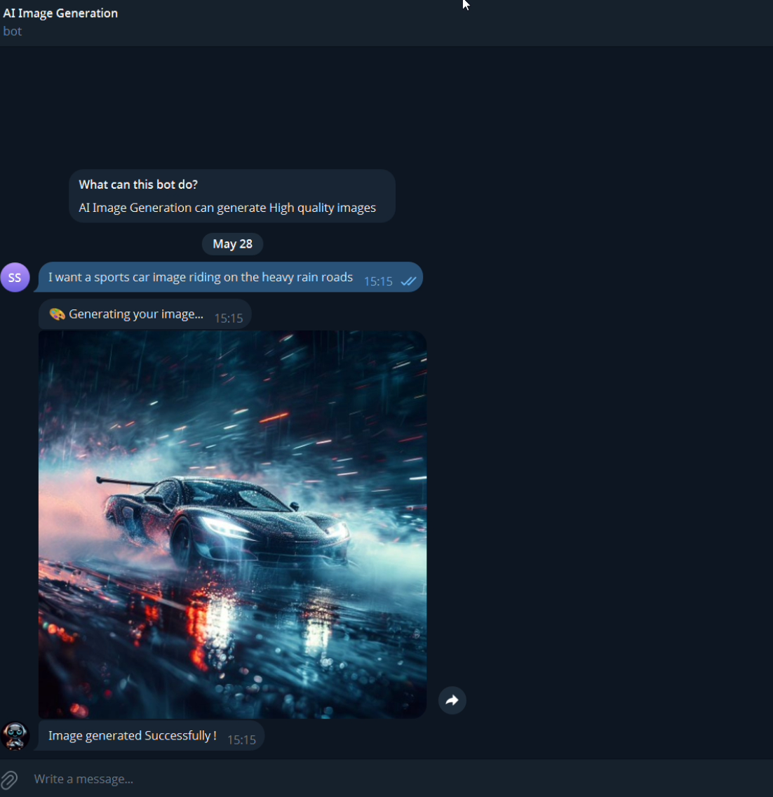

# AI Image Generation Automation System

## Overview:

The AI Image Generation Automation System is an AI-powered workflow automation project developed using n8n, Telegram Bot API, Gemini AI, Pollinations AI, Google Sheets, Docker, and ngrok.
The system allows users to send image prompts directly through a Telegram bot. The workflow automatically receives the prompt, validates the input, performs safety moderation checks, enhances the prompt using Gemini AI, generates AI images using Pollinations AI, and sends the generated image back to the user automatically in real-time.

Additionally, the workflow stores usernames, prompts, generated image URLs, timestamps, and request statuses inside Google Sheets for analytics, monitoring, and tracking purposes.

The entire automation pipeline is built using n8n HTTP Request nodes, IF nodes, Set nodes, Telegram integrations, and conditional workflow logic, enabling a fully automated AI image generation system without manual intervention.

## Workflow Flow

Telegram User Prompt → Telegram Trigger → Extract User Data → Prompt Validation → Safety Moderation Check → Gemini Prompt Enhancement → Generate AI Image → Send Generated Image to User → Store Data & Analytics in Google Sheets

## Features
1. AI-powered image generation through Telegram

2. AI prompt enhancement using Gemini AI

3. Real-time AI image generation and delivery

4. Google Sheets analytics and workflow tracking

5. Fully automated workflow using n8n automation

### Advanced Safety Moderation System

The workflow automatically detects harmful or restricted prompts before generating AI images to ensure safe and responsible AI usage.

If unsafe content is detected, the request is blocked and the user receives a warning response.

### Example

**User Prompt:**

"Generate violent harmful content"

**System Response:**

"Restricted content detected. Please try a valid prompt."

## Tech Stack

1. n8n – Workflow automation platform

2. Telegram Bot API – User interaction and image delivery

3. Gemini AI API – Prompt enhancement and optimization

4. Pollinations AI API – AI image generation

5. HTTP Request Node (n8n) – API communication and integrations

6. IF Node (n8n) – Conditional workflow logic

7. Set Node (n8n) – Data extraction and processing

8. Google Sheets API – Analytics and workflow logging

9. Docker – Local hosting and container management

10. ngrok – Public URL access for local workflow testing

## Major Debugging Challenges Solved

1. Fixed broken AI prompts and image links.

2. Corrected wrong workflow paths in n8n.

3. Solved issues where AI generated wrong images.

4. Fixed Pollinations AI image generation and repeated image problems.

5. Resolved Google login and redirect setup errors.

6. Fixed data passing and dynamic expression issues in the workflow.

## Workflow Architecture

## Demo

🎥 [Watch Project Demo](Demo.mp4)

## n8n Workflow

## Output 

## Result

## Data storage

## Challenges Solved

1.Automated the complete AI image generation workflow

2.Reduced manual processing using n8n automation

3.Improved AI image accuracy with prompt enhancement

4.Implemented real-time image delivery and analytics tracking

## Use Cases

1.AI image generation platforms

2.Telegram AI assistant bots

3.AI-powered creative automation

4.Social media content generation

5.Automated design generation systems

6.Real-time AI workflow automation

## Author

Developed by Sathwik
